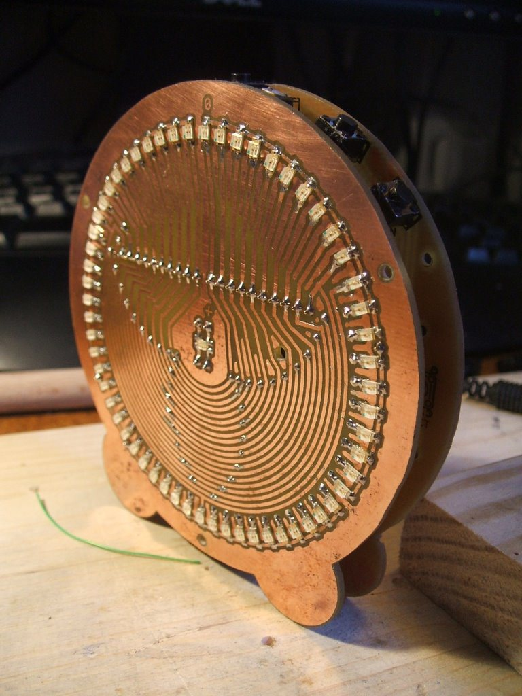

Circular LED Clock
==================

This is an digital LED "Analogue" clock using 60 dicrete LEDs in a circular pattern.
It's an old project built on two single sided boards. The boards are designed for easy home fabrication using the toner transfer technique.  The CPU board uses all DIP parts, the display board uses surface mount LEDs in 1206 package.

The MCU is a 18f2525 with a Maxim MAX6956 driving the LEDs and a Maxim DS1307 keeping time.

[More information is available on my blog.](http://catmacey.wordpress.com/projects/led-clock-project/led-clock-project-details/)

